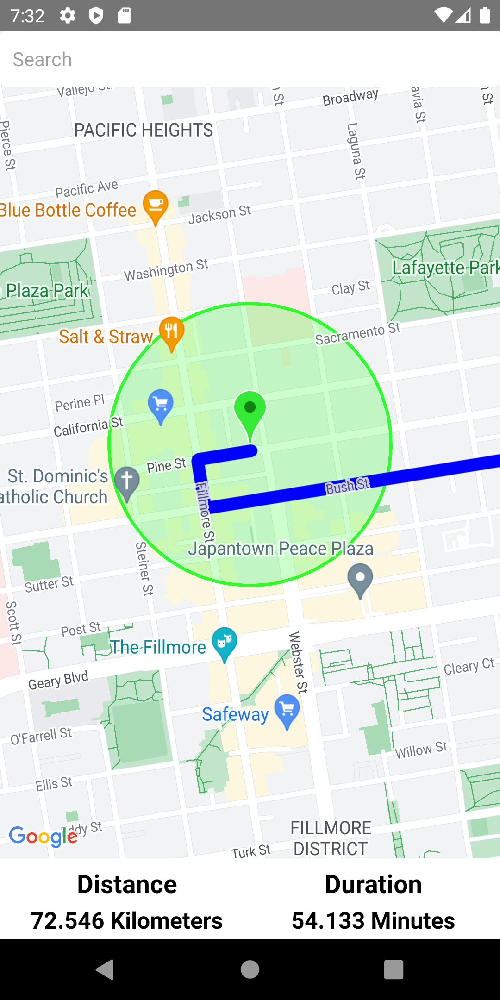
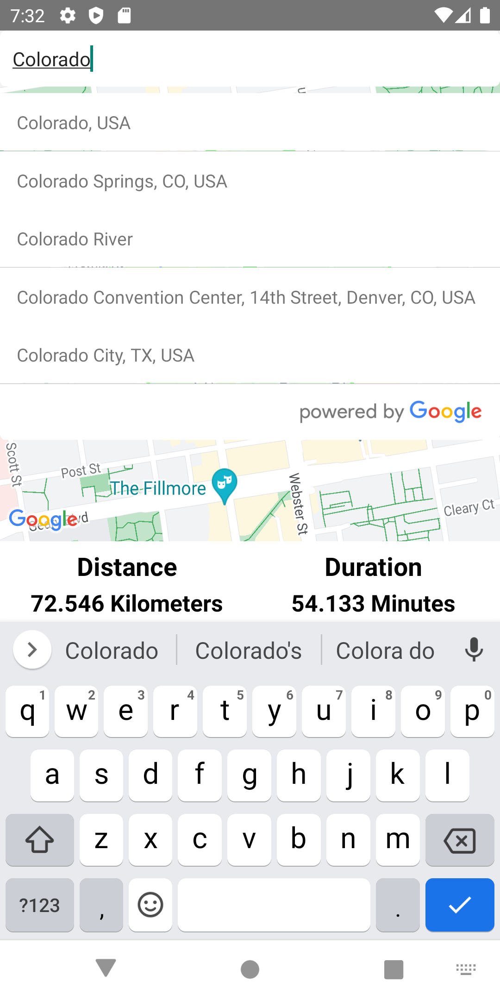

# React-Native-Maps-Project

A project using React native maps.

# Used Technologies:

- React
- React Native
- react-native-maps
- react-native-maps-directions
- react-native-google-places-autocomplete

# Features:

- React native Maps
- Draggable markers
- Directions
  - Displaying Distance
  - Displaying Trip Duration
- react-native-google-places-autocomplete
  - Search places

# Showcase:

